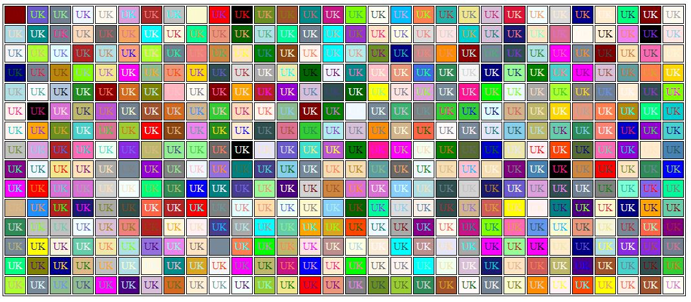

# Generador de Tablas Dinámicas con PHP

Aplicación web desarrollada con PHP para generar tablas dinámicas con colores aleatorios.

## Instrucciones:

Pasar los parámetros directamente en la URL:

`http://localhost/GeneradorTablas/generadorTabla.php?filas=15&columnas=30`

## 🌍 Mis redes sociales, por si deseas contactarme 👨‍💻 :

- [LinkedIn](https://pe.linkedin.com/in/uskokrum2010)
- [YouTube](https://youtube.com/uskokrum2010)
- [Instagram](https://instagram.com/uskokrum2010)
- [Twitter](https://twitter.com/uskokrum2010)
- [Telegram](https://t.me/uskokrum2010_yt)
- [Facebook](https://facebook.com/UskoKruM2010)
- [Sitio web](https://uskokrum2010.com)
- Email: uskokrum2010@gmail.com
